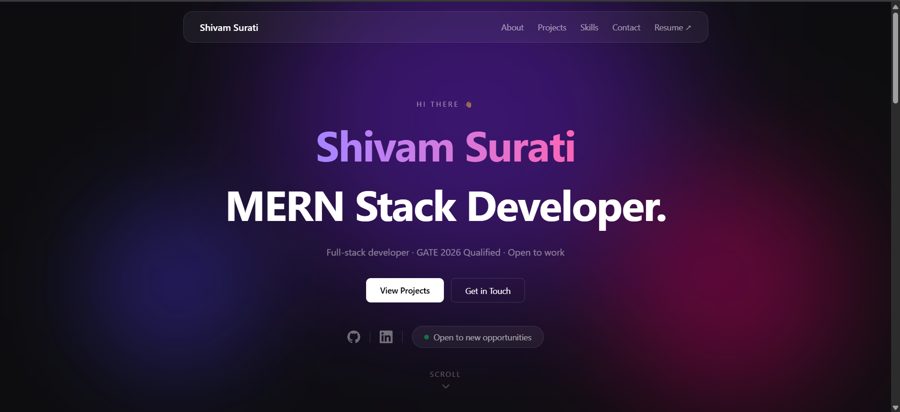

# Shivam Surati — Portfolio

A clean, minimal developer portfolio built with React and Tailwind CSS. Dark theme with animated gradient backgrounds, smooth scroll navigation, and a rolling tech stack marquee.

🔗 **Live:** [portfolio-nu-three-15.vercel.app](https://portfolio-nu-three-15.vercel.app)

---

## Preview



> To add the preview: take a full-page screenshot of the live site, save it as `preview.png` and drop it in the `public/` folder, then push to GitHub.

---

## Built With

| Tech | Purpose |
|------|---------|
| React 18 + Vite | Frontend framework and build tool |
| Tailwind CSS v4 | Utility-first styling |
| Custom CSS | Marquee animation, mask-image fade |
| Vercel | Deployment with auto CI/CD |

---

## Sections

- **Hero** — name, role, social links, status badge, scroll indicator
- **About** — bio and rolling tech stack marquee
- **Projects** — featured hireReady project with live and GitHub links
- **Contact** — email, LinkedIn, GitHub direct links
- **Footer** — copyright

---

## Features

- Dark theme with fixed violet/pink/indigo gradient blobs
- Floating glassmorphism navbar with wave hover effect on name
- Smooth scroll navigation with per-section offset tuning
- CSS marquee with `mask-image` fade edges (no color dependency)
- Fully responsive layout
- Resume PDF served from `public/` folder
- Auto-deploy on every GitHub push via Vercel

---

## Run Locally

```bash
git clone https://github.com/shivSurati/portfolio.git
cd portfolio
npm install
npm run dev
```

Open [http://localhost:5173](http://localhost:5173)

---

## Project Structure

```
src/
├── App.jsx              # Root layout + global background blobs
├── index.css            # Tailwind import + marquee animation
└── components/
    ├── Navbar.jsx        # Fixed floating nav with smooth scroll
    ├── Hero.jsx          # Landing section
    ├── About.jsx         # Bio + tech stack marquee
    ├── Projects.jsx      # Project cards
    ├── Contact.jsx       # Contact links
    └── Footer.jsx        # Footer
public/
└── shivam_resume_2026.pdf
```

---

## Deployment

Deployed on [Vercel](https://vercel.com). Every push to `main` triggers an automatic production build.

```bash
git add .
git commit -m "your message"
git push
# Vercel auto-deploys within ~60 seconds
```


---

*Designed and built by [Shivam Surati](https://www.linkedin.com/in/shivam-surati/)*
